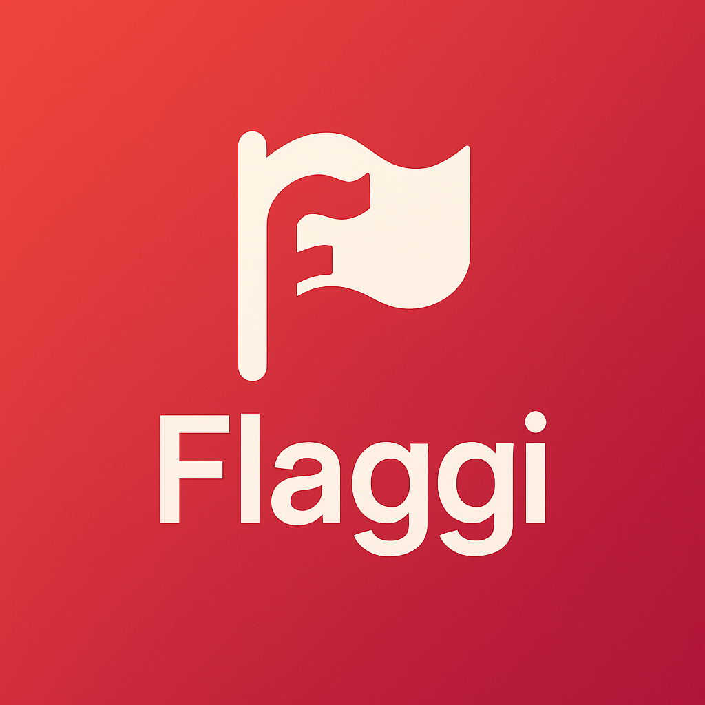

<p align="center">
  
</p>

<h1 align="center">🚩 Flaggi · Feature Flags for .NET</h1>

<p align="center">
  <a href="https://www.nuget.org/packages/Flaggi">
    
  </a>
  <a href="https://www.nuget.org/packages/Flaggi">
    
  </a>
  <a href="LICENSE">
    
  </a>
</p>

Flaggi is a **pure and extensible feature flag engine for .NET**.
It aims to make feature management simple, predictable and self-contained.

Unlike many solutions that require external services or heavy dependencies, Flaggi runs entirely in your application.
This repository contains the **core engine, evaluators, stores** and optional extension packages for **configuration, dependency injection and Blazor integration**.

## ✨ Why Flaggi?

Modern feature management solutions often rely on hosted services or require pulling in large SDKs.
Flaggi was designed from the ground up to be **minimal, fast and unopinionated**, so you only pay for what you use.

### Key benefits

* **Pure and dependency-free** – no external dependencies. Works in any .NET project (console, desktop, cloud, Unity, Blazor, games).
* **Self-hosted** – evaluations happen locally using your own data. No network calls or external services.
* **Predictable and deterministic** – percentage rollout is based on deterministic hashing.
* **Extensible by design** – plug in your own rule evaluators and stores (EF Core, Redis, Azure App Configuration, etc.).
* **Composite stores** – combine multiple stores (in-memory, config, JSON, remote) in order of precedence.
* **Cross-platform** – .NET 6/7/8/9, Unity, Blazor Server/WASM. Works on Windows, Linux and macOS.
* **Test friendly** – includes an in-memory store for unit testing and overrides.
* **MIT licensed** – free to use in both open source and commercial projects.


## 🎯 Motivation

Flaggi exists because many teams want **feature toggling without heavy SaaS or proprietary systems**.
Other libraries often require a server, a cloud dashboard or come with embedded A/B testing logic.

Flaggi’s goal is to provide a **thin, composable layer** you can adopt gradually:

* Start with a simple in-memory store for development.
* Add configuration files, DI helpers or Azure integration later.

Keeping the **core small and extensible** gives you **full control** over how and where your flags are stored and evaluated.


## 🛠️ How it works

Flaggi separates feature management into **three concepts**:

1. **Features** – each feature has a unique key, an `IsEnabled` master switch, and a list of rules.
2. **Rules** – reference a rule evaluator by name and parameters.
3. **Context** – represents the user/environment (e.g. UserId, Groups, region, tenant, etc.).

### Evaluation flow

1. Client asks the **Feature Manager** if a feature is enabled for a given context.
2. Manager retrieves the feature definition from the store (in-memory, file, config, remote, composite).
3. Engine processes the feature:

   * If `IsEnabled` is `false` or expired → returns `false`.
   * Otherwise, iterates rules. If any rule evaluator returns `false` → feature disabled.
   * If all rules return `true` → feature enabled.


## 🔌 Built-in Evaluators

* **Percentage** – rollout to X% of users.

  ```csharp
  new FeatureRule("Percentage", new { value = 20 });
  // Enabled for 20% of users
  ```

* **Targeting** – enable for specific users or groups, with optional fallback percentage.

  ```csharp
  new FeatureRule("Targeting", new { 
      users = new[]{"admin@example.com"}, 
      defaultRolloutPercentage = 10 
  });
  // Enabled for admin + 10% of everyone else
  ```

* **Schedule** – enable feature in a time window (ISO 8601).

  ```csharp
  new FeatureRule("Schedule", new { 
      from = "2025-09-01T00:00:00Z", 
      to = "2025-09-30T23:59:59Z" 
  });
  // Enabled only in September 2025
  ```

👉 You can also create custom evaluators by implementing `IRuleEvaluator` and registering them with the engine or via DI.

---

## 📦 Packages

Flaggi is split into **focused extension packages** so you only add what you actually need.
All are available on **NuGet**.

| Package                                   | Description                                                                                                                         | Use cases                                                                                                                                                                             | NuGet                                                                                                                                                      |
| ----------------------------------------- | ----------------------------------------------------------------------------------------------------------------------------------- | ------------------------------------------------------------------------------------------------------------------------------------------------------------------------------------- | ---------------------------------------------------------------------------------------------------------------------------------------------------------- |
| **Flaggi.Core**                           | The heart of Flaggi: feature engine, `Feature`, `FeatureRule`, `FeatureContext`, rule evaluation pipeline, and the in-memory store. | Use this if you want the **bare metal** experience: build your own stores, register evaluators manually, run in console apps, Unity, background services or test projects without DI. | [](https://www.nuget.org/packages/Flaggi.Core)                                                     |
| **Flaggi.Extensions.Configuration**       | Adds support for `IConfiguration` (e.g. `appsettings.json`, environment variables).                                                 | Ideal for **ASP.NET Core apps** where features are declared in `appsettings.json` or loaded from environment variables at startup.                                                    | [](https://www.nuget.org/packages/Flaggi.Extensions.Configuration)             |
| **Flaggi.Extensions.DependencyInjection** | Provides fluent APIs to register the engine, evaluators and stores via DI.                                                          | Recommended for **ASP.NET Core / Blazor projects** where you want one-liner configuration: `.AddFlaggi().AddDefaultEvaluators().AddFromConfiguration(builder.Configuration)`.         | [](https://www.nuget.org/packages/Flaggi.Extensions.DependencyInjection) |
| **Flaggi.Extensions.Blazor**              | Components and helpers for Blazor (Server/WASM). Provides `FeatureView` and `IFeatureManager` integration with the UI layer.        | Perfect when you want **UI-driven feature flags** (e.g. hide/show components, beta banners, experimental flows) directly in your Blazor pages.                                        | [](https://www.nuget.org/packages/Flaggi.Extensions.Blazor)                           |
                         |

⚠️ Each extension package is **optional**.
Install only what you need.
The **Core** does not reference `Microsoft.Extensions.*`, so you can use it in isolated contexts (Unity, games, libraries) without pulling in ASP.NET Core dependencies.

💡 With this modular setup:

* Start with **Core** in tests or console apps.
* Add **Configuration** to bind flags from config files.
* Add **DependencyInjection** for ASP.NET Core/Blazor apps.
* Add **Blazor** if you want UI components driven by flags.


## 🚀 Quick Start (Core)

The **core library** exposes only the primitives – you manage your own store and rule registration.
Here’s how to get started **without DI or extensions**:

```csharp
// 1. Define your features
var features = new[]
{
    new Feature(
        key: "WelcomeBanner",
        isEnabled: true,
        rules: new[]
        {
            new FeatureRule(
                ruleName: "Targeting",
                parameters: new Dictionary<string, object?>
                {
                    ["users"] = new [] { "vip@example.com" },
                    ["defaultRolloutPercentage"] = 50
                }
            )
        }
    ),
    new Feature(
        key: "ExperimentalCheckout",
        isEnabled: false // master switch, always disabled
    )
};

// 2. Create a store (in-memory) and the engine
var store = new InMemoryFeatureStore(features);
var engine = new FeatureEngine(new IRuleEvaluator[]
{
    new PercentageRuleEvaluator(),
    new TargetingRuleEvaluator(),
    new ScheduleRuleEvaluator()
});
var manager = new FeatureManager(store, engine);

// 3. Create a context and check the feature
var ctx = new FeatureContext(
    userId: "alice@example.com",
    groups: new[] { "BetaTesters" },
    properties: new Dictionary<string, object?> { ["region"] = "BR" }
);
bool isBannerEnabled = await manager.IsEnabledAsync("WelcomeBanner", ctx);
// isBannerEnabled → true or false depending on hash and rules
```
## 📄 Reading from a JSON file

For production deployments, you may want to load flags from a **static file**.
Use the built-in `JsonFileFeatureStore` to read from `flaggi.json` or `appsettings.json`.

**flaggi.json**

```json
{
  "Features": [
    {
      "Key": "DarkMode",
      "IsEnabled": true,
      "Rules": [
        { "RuleName": "Percentage", "Parameters": { "value": 30 } }
      ]
    }
  ]
}
```

**Usage**

```csharp
var store = new JsonFileFeatureStore("flaggi.json");
// reuse the same engine and manager
bool darkMode = await manager.IsEnabledAsync("DarkMode", ctx);
```

## 🧩 Composing multiple stores

Combine multiple stores by **priority** using the `CompositeFeatureStore`.
For example, override in-memory → fallback to config → then JSON:

```csharp
var composite = new CompositeFeatureStore(new[]
{
    new InMemoryFeatureStore(new []
    {
        new Feature("KillSwitch", isEnabled: false) // local override
    }),
    new ConfigurationFeatureStore(builder.Configuration),
    new JsonFileFeatureStore("flaggi.json")
});
var manager = new FeatureManager(composite, engine);
```

## 🧩 Using Flaggi with Dependency Injection

When building **ASP.NET Core** or **Blazor** apps, you typically rely on DI.
The `Flaggi.Extensions.DependencyInjection` package provides fluent APIs to register and configure services.

### Basic setup

```csharp
builder.Services
    .AddFlaggi()
    .AddDefaultEvaluators()
    .AddFromConfiguration(builder.Configuration);
```

This registers:

* `IFeatureStore` → composite store using `IConfiguration("Features")`
* `IFeatureEvaluator` → default evaluators
* `IFeatureManager` → high-level API

### 🔧 Override features in memory

Use `AddFeatures` to add **local overrides**.
Overrides are evaluated **last** in a composite store, giving them highest priority.

```csharp
builder.Services
    .AddFlaggi()
    .AddDefaultEvaluators()
    .AddFeatures(new[] { new Feature("KillSwitch", isEnabled: true) })
    .AddFromConfiguration(builder.Configuration);
```

### 🛠️ Register custom evaluators

```csharp
public sealed class TenantRuleEvaluator : IRuleEvaluator
{
    public string Name => "Tenant";
    public bool Evaluate(FeatureRule rule, FeatureContext ctx, string featureKey)
    {
        var requiredTenant = rule.Parameters["id"]?.ToString();
        return ctx.Properties.TryGetValue("tenantId", out var tenant) && tenant?.ToString() == requiredTenant;
    }
}
```

**Registering the evaluator**

```csharp
builder.Services
    .AddFlaggi()
    .AddEvaluator<TenantRuleEvaluator>()
    .AddDefaultEvaluators()
    .AddFromConfiguration(builder.Configuration);
```

Boa! Mantive o estilo uniforme do seu README, deixando essa parte de **Blazor Integration** bem organizada com headings, exemplos em código e listas para boas práticas. Veja como ficou:


## 🕸️ Blazor Integration

The **`Flaggi.Extensions.BlazorWasm`** package simplifies feature gating in **Blazor WebAssembly**.
It provides:

* **`HttpFeatureStore`** – fetches flags from a JSON endpoint or static file.
* **`<FeatureGate>` component** – conditionally renders UI based on feature evaluation.


### ⚙️ Setup in Blazor WASM

```csharp
builder.Services
    .AddScoped(sp => new HttpClient { BaseAddress = new Uri(builder.HostEnvironment.BaseAddress) })
    .AddFlaggi()
    .AddDefaultEvaluators()
    .AddFromJsonFile("flaggi.json");
```

---

### 🧩 Using the `<FeatureGate>` component

```razor
@using Flaggi.Extensions.BlazorWasm

<FeatureGate Feature="Dashboard.V2" Context="@ctx">
    <DashboardNew />
    <Fallback>
        <DashboardOld />
    </Fallback>
</FeatureGate>

@code {
    private FeatureContext ctx = new("user1", new[] { "BetaTesters" }, new Dictionary<string, object?>());
}
```

👉 The `<FeatureGate>` component will render **`<DashboardNew />`** if the feature is enabled, or the **`<Fallback>`** content when it is not.

### 🖥️ Blazor Server

For **Blazor Server**, reuse the same API by injecting `IFeatureManager` and evaluating features directly in your component or page.

## 🎯 Scenarios & Best Practices

Flaggi can be used to implement a variety of **feature-management patterns**:

* **Beta testing** – allow specific users or groups to try new features before general rollout using the **Targeting** rule.
* **Gradual rollout** – slowly increase the **Percentage** value over time to mitigate risk and monitor impact.
* **Kill switch** – define a global kill switch. Set `IsEnabled = false` to immediately disable a feature across all users.

  * In ASP.NET, add a middleware that checks a kill switch and returns **503 Service Unavailable** to protect endpoints.
* **Scheduled releases** – enable a feature only during a promotional period or event using the **Schedule** rule.
* **Multi-tenant apps** – attach tenant info to the `FeatureContext` and create custom evaluators (Tenant, Region) to enable features per tenant or region.
* **Environment flags** – load different config files or use environment variables to enable features only in dev/staging.
* **A/B experiments** – while Flaggi isn’t a full experimentation platform, you can implement a custom evaluator that buckets users into variants based on a hash.

## 🌱 Future Ideas

Flaggi is intentionally small, but there are many areas for growth.
Some ideas for future extensions include:

* **Expression evaluator** – support rules based on logical expressions (e.g. JSON Logic, NCalc, dynamic LINQ).
* **Time of day / day of week** – enable features only during working hours or weekends.
* **Region and locale** – automatically enable features based on user’s country or language.
* **Remote management UI** – build an admin UI to toggle flags at runtime, possibly with audit logging.
* **Distributed stores** – add providers for SQL Server, Redis, Cosmos DB or gRPC to share flags across instances.
* **Automated rollout** – integrate with metrics to automatically increase rollout percentage if error rates remain low.

💡 **Contributions are welcome!**
Feel free to open issues or pull requests with new ideas.

## ✅ Testing

Flaggi was designed with **testability** in mind.
Use the `InMemoryFeatureStore` or create a fake store for your tests, and register only the evaluators you need.

```csharp
var features = new[]
{
    new Feature("NewUI", true, new[]
    {
        new FeatureRule("Percentage", new Dictionary<string, object?> { ["value"] = 100 })
    })
};
var store = new InMemoryFeatureStore(features);
var engine = new FeatureEngine(new [] { new PercentageRuleEvaluator() });
var manager = new FeatureManager(store, engine);
var ctx = new FeatureContext("test", Array.Empty<string>(), new Dictionary<string, object?>());

Assert.True(await manager.IsEnabledAsync("NewUI", ctx));
```

You can also **mock** `IFeatureStore` and `IRuleEvaluator` to test specific conditions without evaluating real rules.

---

## 📄 Contributing

We welcome contributions!
If you have an idea for a new evaluator, store or integration, **open an issue or submit a pull request**.

Please include:

* ✅ Tests
* 📖 Documentation
* 💡 Clear description of the feature

See the existing codebase for reference implementations.

## 🛡️ License & Authorship

Flaggi is licensed under the **MIT License**.

👤 Created by **Iury Ferreira**

## ❤️ Thanks

Thank you for using **Flaggi**!

We hope it helps you manage features in a clean, maintainable way.

Feel free to reach out with **feedback, questions or ideas for improvement**. 🚀
